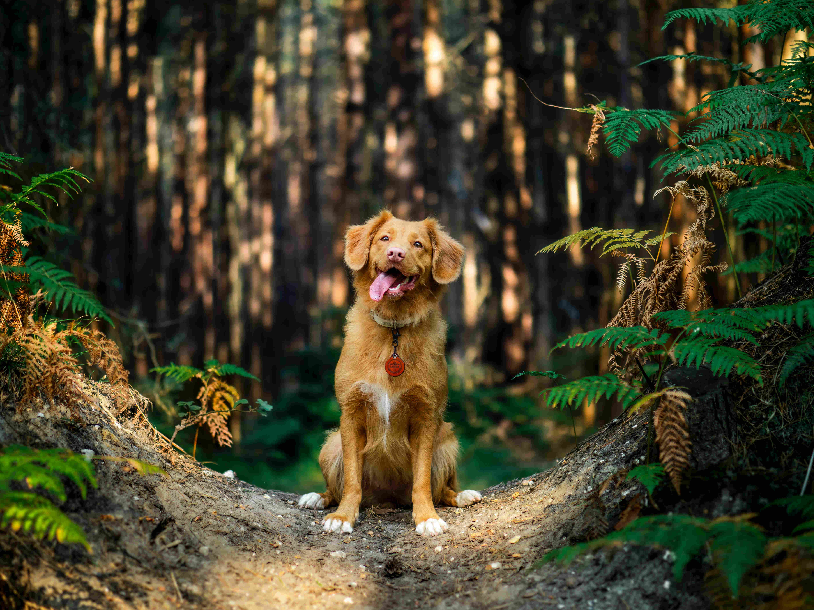

# awesome-forests 
**Awesome-forests** is a curated list of ground-truth forest datasets for the machine learning and forestry community. The list targets data-based biodiversity, carbon, wildfire, ecosystem service, and general ecosystem analysis.

Getting started with data science in forests is HARD. The lack of organized datasets is one reason why. So, this list of datasets intends to get you started with analysing your forests.

This is a wide open and inclusive community; please feel free to add your favorite datasets via a pull request. 

Photo of a dog in a forest, by [Jamie Street](https://unsplash.com/@jamie452) on [Unsplash](https://unsplash.com/?utm_source=unsplash&utm_medium=referral&utm_content=creditCopyText)

## Contents
- [**Tree species classification**](#tree-species-classification)
- [**Tree detection**](#tree-detection)
- [**Biodiversity**](#biodiversity)
- [**Tree crown segmentation**](#tree-crown-segmentation)
- [**Carbon quantification**](#carbon-quantification)
- [**Forest type classification**](#forest-type-and-land-cover-classification)
- [**Change detection**](#change-detection-and-deforestation)
- [**Wildfire**](#wildfire)
- [**Raw geospatial imagery**](#raw-geospatial-imagery)
- [**Awesome-awesome**](#awesome-awesome)

## Tree species classification
#### Processed
- [**IDtrees NIST NEON**](https://idtrees.org/competition/) *(Weecology, University of Florida, NEON, 2020)* \
A tree species classification dataset from ≈3 National Forest sites, USA, with ≈400 labeled trees of ≈20 species with airborne RGB, Hyperspectral and Lidar imagery.

- [**Kaggle Forest Cover Type**](https://www.kaggle.com/c/forest-cover-type-kernels-only/data) *(USFS, 2013?)* \
A tree species classification dataset from Roosevelt National Forest, USA, with ≈15k labeled and ≈565k unlabeled trees with cartographic variables.

- [**Pasadena Urban Trees**](http://www.vision.caltech.edu/registree/publications-and-dataset.html) *(Caltech, 2016)* \
A tree species classification dataset from urban Pasadena, USA, with ≈ 80k labeled trees of 18 species with airborne and ground RGB imagery.

- [**Open AI Challenge: Aerial Imagery of South Pacific Islands**](https://docs.google.com/document/d/16kKik2clGutKejU8uqZevNY6JALf4aVk2ELxLeR-msQ/edit) *(WeRobotics, Worldbank, 2018)* \
A tree species classification dataset from Kingdom of Tonga with 50km² data of 4 species with airborne RGB imagery.

#### Raw
- [**Raw urban street tree inventory data**](https://enterprisecontentnew-usfs.hub.arcgis.com/datasets/raw-urban-street-tree-inventory-data-for-49-california-cities) *(USFS, 2006-2013)* \
A raw dataset from 49 cities in California, USA, with ≈930k trees with forest structure variables (e.g., tree species, height, DBH, crown).

- [**New York City Street Tree Map**](https://tree-map.nycgovparks.org/) *(NYC Parks, ?-2021)* \
A raw dataset from urban New York City, USA, with >680k trees of >230 species.

- [**Raw data for urban trees in California communities**](https://enterprisecontentnew-usfs.hub.arcgis.com/datasets/7421b43097d04e82ba05835bda8600ec) *(USFS, 2007-2012)* \
A raw dataset from urban California, USA, with ≈4k trees with forest structure variables (e.g., tree species, height, DBH, crown).

- [**NEON Woody Plant Vegetation Structure**](https://data.neonscience.org/browse-data) *(NEON)* \
A raw dataset from 49 US national forests with forest structure variables (e.g., tree species, height, DBH, low-res. GPS)

## Tree detection
#### Processed
- [**DeepForest WeEcology NEON**](https://github.com/weecology/NeonTreeEvaluation) *(Weecology, NEON, UofFlorida, 2018)* \
A tree detection dataset from ≈22 National Forest sites, USA with >15k labeled and >400k unlabeled trees with airborne RGB, Hyperspectral, and Lidar imagery.

- [**Kaggle Aerial Cactus Identification**](https://www.kaggle.com/c/inaturalist-2019-fgvc6/overview) *(CONACYT)* \
A cactus detection dataset from Mexiko with 17k cacti with airborne RGB imagery.

- [**Swedish National Forest Data Lab: Forest Damages – Larch Casebearer 1.0.**](http://lila.science/datasets/forest-damages-larch-casebearer/) *(Swedish Forest Agency 2021)* \
A tree detection and classification dataset from 10 sites with RGB drone imagery. In total ~ 102k annotated bounding boxes labeled "Lark" or "other", of which ~ 44,5k are also labeled describing tree 
damage in four categories.

#### Raw
* see [Tree species](#tree-species-classification)

## Biodiversity
- [**Kaggle iNaturalist**](https://www.kaggle.com/c/inaturalist-2021) *(iNaturalist, FGVC8, 2021)* \
A flora and fauna species classification dataset from global sites with 2.7M labeled images of 10k species with smartphone imagery.

- [**Kaggle GeoLifeCLEF 2021**](https://www.imageclef.org/GeoLifeCLEF2021) *(ImageCLEF, 2021)* \
A flora and fauna location-based species recommendation dataset from France with 1.9M labeled images of 31k species with satellite imagery and cartographic variables.

## Carbon quantification
* see [Tree species](#tree-species-classification) for now.

* todo: add allometric equations and above- and belowground carbon inventories

## Tree crown segmentation
#### Processed
* todo

#### Raw
* [**An Unexpectedly Large Count of Trees in the West African Sahara and Sahel**](https://daac.ornl.gov/cgi-bin/dsviewer.pl?ds_id=1832) (Brandt et al., 2020) \
A raw dataset of the West Sahara with ≈3k tree crown segmentations.

## Forest type and land cover classification
- [**BigEarthNet: large-scale Sentinel-2 benchmark**](http://bigearth.net/) *(TU Berlin, 2019)* \
A landcover multi-classification dataset from 10 European countries with ≈600k labeled images with CORINE land cover labels with Sentinel-2 L2A (10m res.) satellite imagery.

- [**Chesapeake land cover**](http://lila.science/datasets/chesapeakelandcover) *(Chesapeake Conservancy, Microsoft, NAIP, USGS, 2013-2017)* \
A land cover classification dataset from the Chesapeake Bay, USA, of a 6x7km² area with high- and low-resolution (NLCD) land cover labels with high- (NAIP, RGB-NIR) and low-resolution (Landsat 8, 13-band) satellite imagery.

- [**Kaggle Planet: Understanding the Amazon from Space**](https://www.kaggle.com/c/planet-understanding-the-amazon-from-space) *(SCCON, Planet, 2017)* \
A land cover classification dataset from the Amazon with deforestation, mining, cloud labels with RGB-NIR (5m res.) satellite imagery.

- [**WiDS Datathon 2019: detection of oil palm plantations**](https://www.kaggle.com/c/widsdatathon2019) *(Global WiDS Team & West Big Data Innovation Hub, 2019)* \
Binary palm oil plantation classification with 20k images with Planet RGB (3m res.) satellite imagery

- [**UC Merced land use dataset**](https://www.tensorflow.org/datasets/catalog/uc_merced)*(UC Merced, 2010)* \
A small land cover classification dataset with 2100 images and 21 balanced classes with airborne (0.3m res.) imagery.

- [**Awesome satellite imagery datasets**](https://github.com/chrieke/awesome-satellite-imagery-datasets) \
A list with more satellite imagery datasets.

## Change detection and deforestation
- [**Dynamic EarthNet challenge**](http://www.classic.grss-ieee.org/earthvision2021/challenge.html) *(Planet, DLR, TUM, 2021)* \
A time-series prediction and multi-class change detection dataset of Europe over 2-years with 75 image time-series with 7 land-cover labels and weekly Planet RGB (3m res.) imagery.

- [**Semantic change detection dataset (SECOND)**](http://www.captain-whu.com/PROJECT/SCD/) *(Yang et al., 2020)* \
A land cover change detection dataset in over cities and suburbs in China with ≈5k image-pairs with 6 land cover classes and airborne imagery.

- [**ForestNet deforestation driver**](https://stanfordmlgroup.github.io/projects/forestnet/) *(Jeremy Irvin, Hao Sheng et al., 2020)* \
A dataset that consists of 2,756 LANDSAT-8 satellite images of forest loss events with deforestation driver annotations. The driver annotations were grouped into Plantation, Smallholder Agriculture, Grassland/shrubland, and Other.

- [**Global Forest Change**](https://glad.earthengine.app/view/global-forest-change) *(University of Maryland, 2013)* \
Different layers of global forest loss, extracted from Landsat satellite imagery, todo: this is a data product, find ground-truth data

- [**Awesome remote sensing change detection**](https://github.com/wenhwu/awesome-remote-sensing-change-detection) \
A list with more change detection datasets.

## Wildfire
* todo: add datasets for fire detection, fuel moisture quantification, wildfire spread prediction, etc.

## Raw geospatial imagery
- [**Global ecosystem dynamics investigation (GEDI)**](https://gedi.umd.edu/data/download/) *(NASA, University of Maryland, 2021)* \
A satellite lidar dataset of the globe with topography and lidar pointcloud (100m res.).

- [**Norway's international climate and forests initiative imagery program (NICFI)**](https://www.planet.com/nicfi/) *(NICFI, Ksat, Airbus, Planet, 2020)* \
A satellite imagery dataset of tropical rainforests with monthly mosaics of RGB (5m res.) satellite imagery. 

- [**National agriculture imagery program (NAIP)**](https://developers.google.com/earth-engine/datasets/catalog/USDA_NAIP_DOQQ) *(FSA USDA, 2003-2021)* \
An airborne imagery dataset of CONUS with RGB-NIR (0.5m res.) imagery.

- see [**awesome-gis**](https://github.com/sshuair/awesome-gis#data)

## Awesome-awesome
- [**Awesome satellite imagery datasets**](https://github.com/chrieke/awesome-satellite-imagery-datasets) \
A list of more satellite imagery datasets with annotations for deep learning and computer vision.

- [**Awesome GIS**](https://github.com/sshuair/awesome-gis) \
A list of GIS resources.

## Attributions
- Awesome-forests contains individual entries from [Awesome satellite imagery datasets](https://github.com/chrieke/awesome-satellite-imagery-datasets) and [Awesome remote sensing change detection](https://github.com/wenhwu/awesome-remote-sensing-change-detection)
